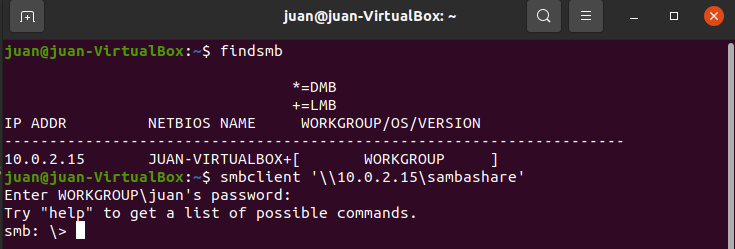

---
Juan Hidalgo
Robert Alberto
CIS 106
Deliverable 3
---

# Deliverable 3 

- [Deliverable 3](#deliverable-3)
- [In part 1 I began by installing the SAMBA package. The 'sudo apt update' command updates and downloads packages from the internet. The 'sudo apt install samba' command installs the SAMBA package.](#in-part-1-i-began-by-installing-the-samba-package-the-sudo-apt-update-command-updates-and-downloads-packages-from-the-internet-the-sudo-apt-install-samba-command-installs-the-samba-package)
- [I also created a backup for the package config file incase anything goes wrong. The 'sudo cp' command copies the file the first path leads to and the second path determines where the copied file will go.](#i-also-created-a-backup-for-the-package-config-file-incase-anything-goes-wrong-the-sudo-cp-command-copies-the-file-the-first-path-leads-to-and-the-second-path-determines-where-the-copied-file-will-go)
- [Here I created a directory for the SAMBA share. The 'mkdir' command lets me create a folder in anywhere defined by the path. I used the 'cd' command to go into the folder where I made my directory to make sure the folder the created.](#here-i-created-a-directory-for-the-samba-share-the-mkdir-command-lets-me-create-a-folder-in-anywhere-defined-by-the-path-i-used-the-cd-command-to-go-into-the-folder-where-i-made-my-directory-to-make-sure-the-folder-the-created)
- [In this step I configured the server, making the directory created in the last step a share. The comment line is the description of the share. The path line is where I make the directory I created the share. The browseable line makes it so that you can browse the share. The read only line makes sure the share is not set in read only so files can be sent to the share.](#in-this-step-i-configured-the-server-making-the-directory-created-in-the-last-step-a-share-the-comment-line-is-the-description-of-the-share-the-path-line-is-where-i-make-the-directory-i-created-the-share-the-browseable-line-makes-it-so-that-you-can-browse-the-share-the-read-only-line-makes-sure-the-share-is-not-set-in-read-only-so-files-can-be-sent-to-the-share)
- [In this step I restarted the SAMBA service and allowed it through my firewall so the share can be accessed. The 'sudo service' command restarts the SAMBA service. The 'sudo ufw' command makes an exception in the firewall that allows SAMBA traffic to go though.](#in-this-step-i-restarted-the-samba-service-and-allowed-it-through-my-firewall-so-the-share-can-be-accessed-the-sudo-service-command-restarts-the-samba-service-the-sudo-ufw-command-makes-an-exception-in-the-firewall-that-allows-samba-traffic-to-go-though)
- [In this step I created a user account for the SAMBA service so the share can be accessed securely. The 'sudo smbpasswd' is a SAMBA command that allows me to create a user account so that when I access my share I can access it securely and not anonymously.](#in-this-step-i-created-a-user-account-for-the-samba-service-so-the-share-can-be-accessed-securely-the-sudo-smbpasswd-is-a-samba-command-that-allows-me-to-create-a-user-account-so-that-when-i-access-my-share-i-can-access-it-securely-and-not-anonymously)
- [In this step I locally connected to my SAMBA share to make sure it can be accessed. The 'smbclient' command allows me to locally connect to a SAMBA share. It then asks me for the password of the 'juan' user account I created in the last step.](#in-this-step-i-locally-connected-to-my-samba-share-to-make-sure-it-can-be-accessed-the-smbclient-command-allows-me-to-locally-connect-to-a-samba-share-it-then-asks-me-for-the-password-of-the-juan-user-account-i-created-in-the-last-step)