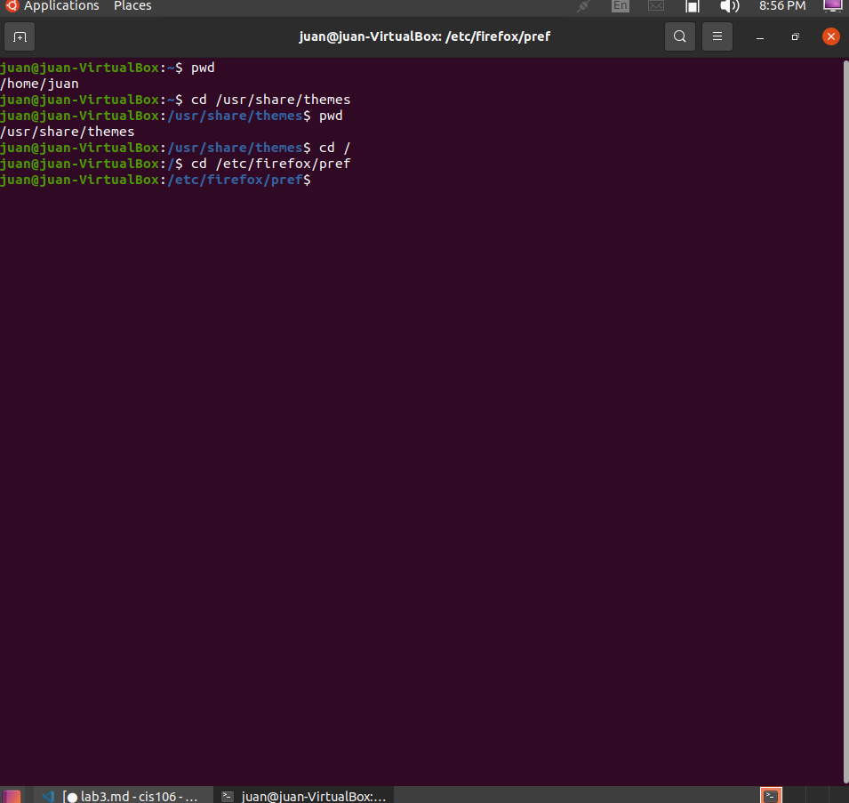
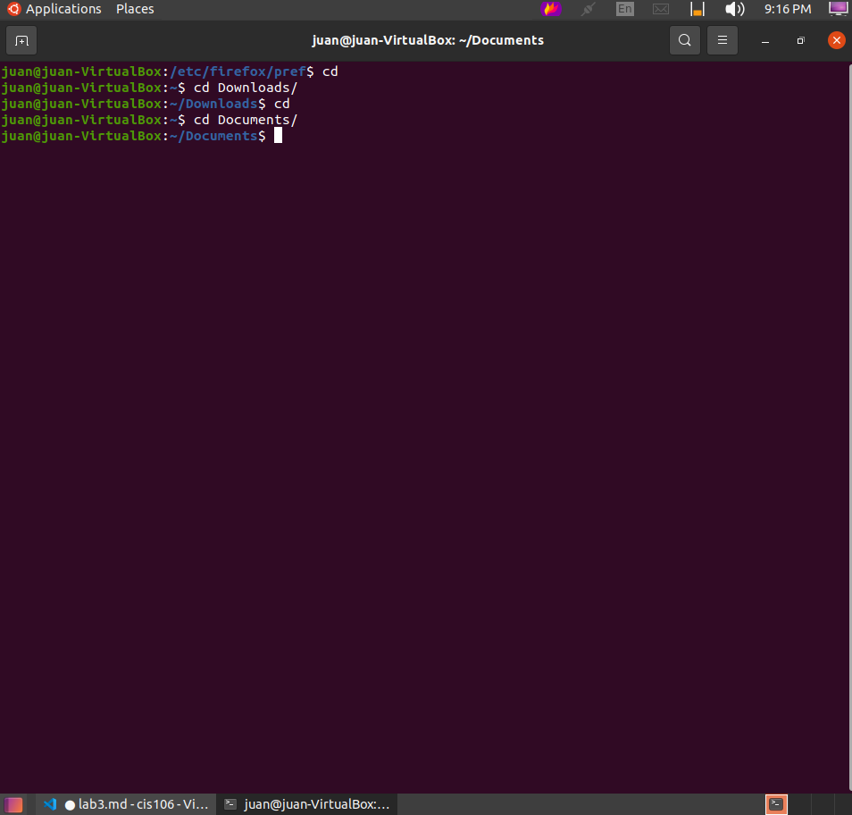
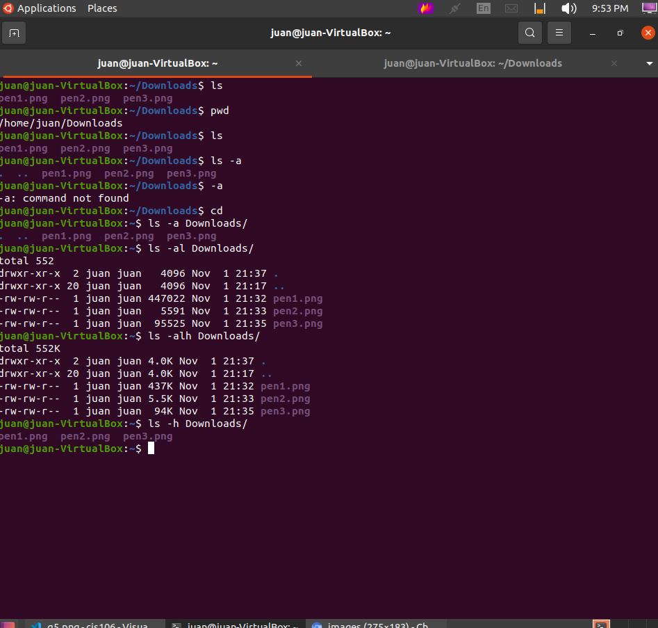
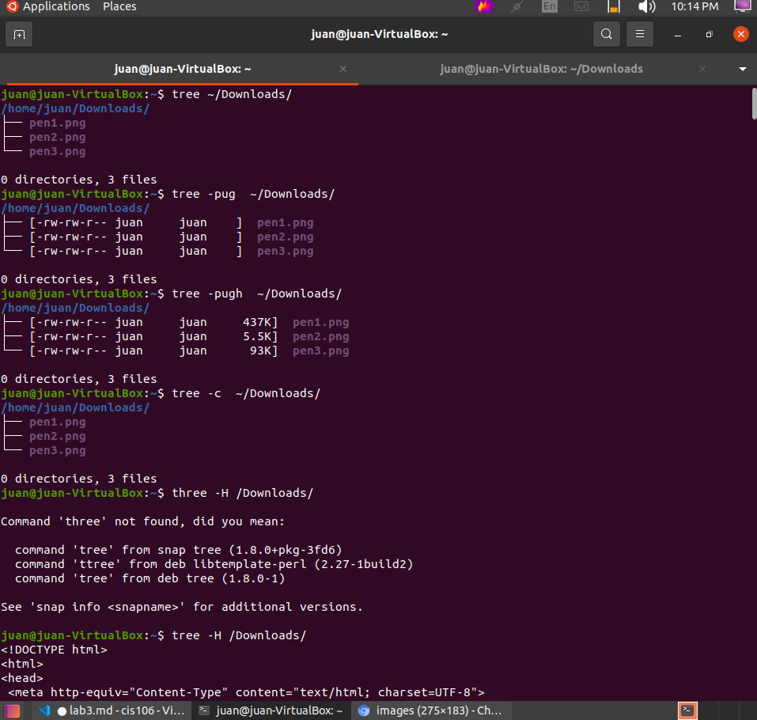
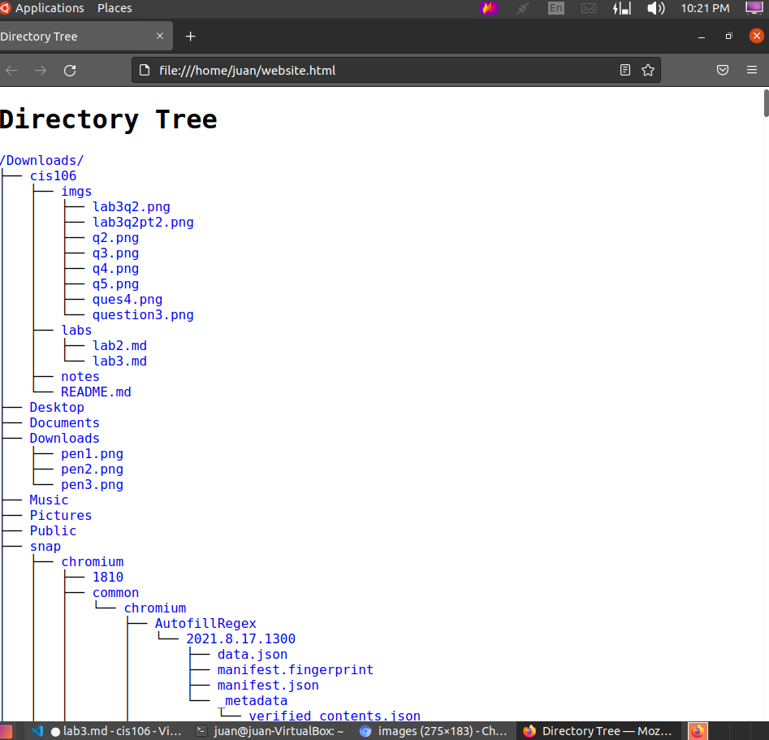
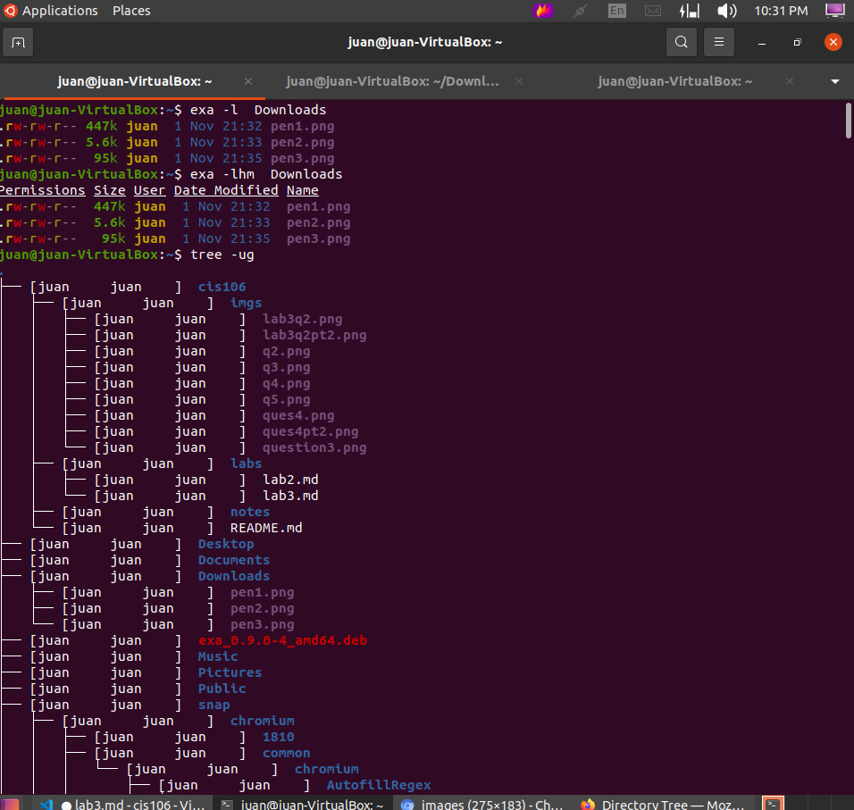

# Lab 3 | Installing software and navigating the file system | Answers
Assignment description [here](https://raw.githubusercontent.com/ra559/cis106/main/labs/lab3.md)

## Question 1
1. Which command did you use to search for the themes and to install them?

~$ sudo apt search theme 
~$ sudo apt install 'Name of package'

2. Which commands did you use to find and install the web browser?
   
~$ sudo apt search surf 

3.1 What is the name of the package?

pink-pony

3.2 What dependencies are needed in order to install the package? (you can either take a screenshot of the terminal or copy and paste from the terminal)

liballegro4.4 libdevil1c2 libftgl2 libglfw3 libilmbase24 libmng2 libtinyxml2.6.2v5 pink-pony-data

3.3 How much disk space will the package utilize after installation?
 
 19.6 MB of additional disk space will be used

## Question 2

## Question 3

## Question 4

## Question 5
